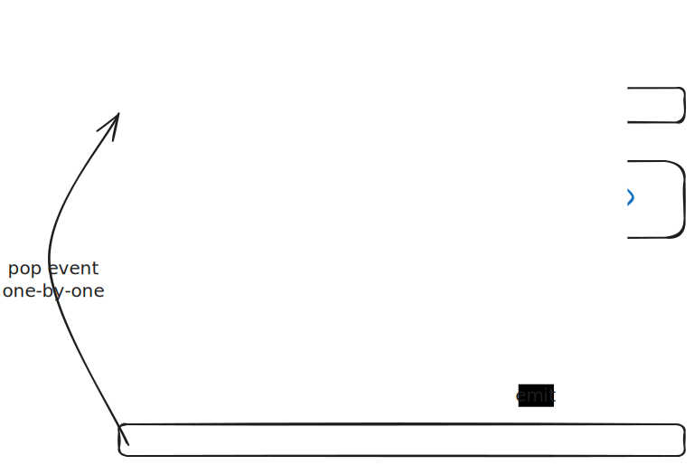

# Pipeline config syntax

## 想定されるユーザ

ユーザを3種類に分類して考えている

- **メインモジュールを書くユーザ**
    - ストリーマー本人を想定している
    - あまりこういうことに詳しくないと想定する。
- **サブモジュールを書くユーザ**
    - 少しITに詳しい人を想定している
- **プラグインまたは本体を書くユーザ**
    - プログラマを想定している

そのためメインモジュールにあたる `main.json5` では、
可能な限り簡単な設定だけを行えば良い形に持っていきたい。

たとえば `inherit` 文法や `name` はdefaultの概念が強く設定されていて、
基本的に特別なことをしない場合何も設定しなくて良いといった特色が現れている
(こうすることで、メインモジュール側では何も考えずプラグインやサブモジュールを差し込むだけでよくなる)


## 基本的な構造

このシステムでは複数のモジュールについて設定を書くことになる。
モジュールにはエントリポイントとなるメインモジュールと、
そこから呼び出して使われるサブモジュールがある。

このシステムの1つ分のモジュールは以下の図のような構成になっている。



ここで主に設定を書く必要があるのは `pipeline` (の中に並んでいる `component action`) の部分となる。

これに対応して一般にモジュール設定ファイルは、以下のような文法を持っている。

```json5
{
  // 後述するコンポネントの継承設定。
  inherit: { ... },
  // サブモジュールのパラメータ設定。
  params: { ... },
  // 本体となるpipeline設定
  pipeline: [
    // ここにcomponent actionの設定を書く(これも後述)
  ]
}
```

メインモジュールに当たる `main.json5` では `pipeline` だけが有効な値になる。
ただし(エントリポイントは可能な限り優しくするため) `params` や `inherit` を書き込んでいてもエラーにならず
ただ無視される。

## pipeline config

pipelineには複数の設定を並べる。
このそれぞれの設定はcomponent actionというものになっている。
それぞれのcomponent actionは以下のような文法で設定を行うことができる。

```json5
{
    // typeはcomponentの種類を指定するフィールド
    // componentは基本的にすべてプラグインとして提供されるので
    // その名称を記述することで該当のプラグインを起動するということ。
    type: "non-exist-component",

    // nameはコンポネントのインスタンスの名称で、
    // パイプライン全体を通して同じnameを持つcomponentは
    // すべて内部データを共有する形になる。
    // また出力データ(=Environment)のキーとしても使われる。
    // 省略でき、省略した場合はデフォルトのインスタンスになる。
    // 基本的に省略して利用する想定だが
    // どうしても同じcomponentを複数使い分けたい場合に名付けることができる。
    name: "main",

    // そのコンポネントで実行するアクションの名前で
    // コンポネント側で定義されている。
    // 省略でき、省略するとデフォルトのアクションが実行される。
    // デフォルトアクションは主にコンポネントの初期化を行うことが望ましく
    // それによってmain moduleにおいて初期化だけを担当する簡単な作りに持っていくことができる。
    action: "shout",

    // whenはコンポネントの実行条件を指定するフィールド。
    // 後述のjexpr(argsの部分参照)による簡単な条件式を記述することができる。
    // この条件に関係なくコンポネントの初期化処理は実行されるという点は注意。
    when: "condition && condition2",

    // argsはコンポネントの実行時に渡る引数のオブジェクトで、
    // このオブジェクトの中身はjexpr構文が適用される。
    args: {
        // argsでは普通のjsonで使える値は全部設定することができる。
        string: "hoge",
        number: 10,
        boolean: true,
        null: null,
        array: ["hoge", "hoge"],
        object: {
            a: "hoge",
            b: "hoge",
        },
        // 文字列は$始まりにすることでjexpr構文が特別に利用できる(詳細後述)
        jexpr: "$ value",
    },
},
```

各コンポネントアクションは、自分の実行が終わったときに、
現在のEnvironmentに対して自分の出力を混ぜ込む。(図中 `discharge` の処理)

また各Component instanceは
(Twitchのメッセージ受信などを受けるための)
内部的にスレッドなどを立ち上げておいて、必要なときにeventをemitすることができる。
このeventは1つずつ順番にpipelineによって処理される。

### Component設定のjexpr構文

`when` と `args` のみ `jexpr` を使って簡単なコードを書くことができる。
これによって パイプライン内 に流れているメッセージの情報を使ったコンポネントの呼び出しができる。

```json5
{
    // whenはコンポネントの実行条件を指定するフィールド。
    // jexpr(argsの部分参照)による簡単な条件式を記述することができる。
    // ちなみにwhenだけはjexprを$なしで使う。
    // この条件に関係なくコンポネントの初期化処理は実行されるという点は注意。
    when: "condition && condition2",

    // argsはコンポネントの実行時に渡る引数のオブジェクトで、
    // このオブジェクトの中身はjexpr構文が適用される。
    args: {
        // 普通のjsonで使える値は全部設定することができる。
        a: "hogehoge",
        // ただし特に文字列でこのように$を頭に書いた場合
        // ここまでに流れてきたEnvironmentの中身が展開される。(jexpr構文)
        b: "$ value",
        // 条件文を使うこともでき、この場合はtrue/falseが帰ってくる。
        c: "$ condition === 'hoge'",
        // オブジェクトの中へのアクセスをする構文も使うことができる。
        // ちなみにたいていのcomponentはpipelineに対して
        // 一気にいろいろな値を流し出すためにオブジェクトを流すだろうから
        // 実際は書き方になりがちだと思う。
        d: "$ twitch.message",
        // 再帰的に引数は展開される。
        recursive: {
            // このように子ノードで書いた場合もvalueが展開される。
            key: "$ value",
            // jexpr構文なのでもちろん比較演算等も行うことができる
            less: "$ value < 10",
            // 文字列の結合や(システムで登録された)関数の適用なども行うことができる。
            concat: "$ format('{}: {}', value1, value2)",
        },
    },
},
```

### submodule component

特別なComponent Typeとして `submodule` が存在する。
これは別のサブモジュールを呼び出すための構文である。

```json5
{
    // Submoduleコンポネントはサブモジュールを呼び出すために使える
    type: "submodule",
    // ターゲットのサブモジュールの入ったjson5名を指定する
    path: "auto_translator.json5",
    // 継承するコンポネントを指定。詳細は後述。また基本的に省略可能。
    inherit: {
        "main": "main",
    },
    // サブモジュール側のparamsで設定されている変数に
    // argsの内容が展開される。
    // paramsにないものは消える。
    args: {
        message: "$ twitch.main.message.message",
    }
}
```

## inherit syntax

submodule側でinheritに`type`とバインディング先の`name`を設定しておくと
呼び出し側に定義されているコンポネントを引き継いで内部でも利用することができる。

そのinstanceを使う(イベント受信やactionの発動)ことができる。
jexprを使って外部側で動的に名称が指定されても評価せずにただの文字列としてとりあつかう。

もしその名称のインスタンスが存在しない場合は、
そのようなsubmoduleの呼び出しでの該当コンポネントインスタンスの利用は無視される。
外部で何もインスタンスを指定しない場合、デフォルトインスタンスが指定されたものと判定する。

つまり以下のような形で定義したsubmoduleを...

```json5
{
  inherit: {
    // "サブモジュール内で使うときのname": "ComponentのType" という形式で指定する
    // この場合 hoge コンポネントをmainに接続するように要求している。
    main: "hoge",
  },
  params: { ... },
  pipeline: [
    // ここには `main` という`name`で `hoge` コンポネントが刺さっているとして取り扱うことができる
    // たとえば適当なアクションを発行することができる
    {
        // この設定で外と同じhogeコンポネントのインスタンスに対して
        // アクションを発行することができる。
        type: "hoge",
        name: "main",
        action: "fuga",
    }
  ],
}
```

以下のように呼び出すことでパイプライン内のコンポネントを受け渡して利用させることができる。

```json5
{
    pipeline: [
        {
            type: "hoge",
            name: "hogehoge"
        },
        {
            type: "submodule",
            path: "sample.json5",
            // 呼び出し側でのinherit。
            // サブモジュール側で定義しておいたinheritに対応させて、
            // 接続するコンポネントインスタンスを指定できる
            inherit: {
                // "サブモジュール内でのname": "呼び出し側でのname"
                "main": "hogehoge", // hogeコンポネントのhogehogeを差し込みしている

                // ちなみにここもjexprを使うことはできない。(whenとargsだけがjexprを使うことができる。)
            },
            args: { ... }
        }
    ],
}
```

ここで **inheritに対して何も指定していない場合はデフォルトのインスタンスが使われる。**

```json5
{
    pipeline: [
        {
            type: "hoge",
            // nameを設定しない = デフォルトインスタンス
        },
        {
            type: "submodule",
            path: "sample.json5",
            // inheritを書かない。
            // これでデフォルトインスタンスが継承されている
            args: { ... }
        }
    ],
}
```

つまりデフォルトインスタンスだけ使っているという典型的な状況なら
基本的にmain側ではこれを指定する必要はないという形になる。

たまに複数のインスタンスをつかいたかったりmain側で色々とインスタンスを使っている場合は
ここの指定が必要になる(=エントリポイントでは基本的に何も設定しなくてもそれらしく動く)

